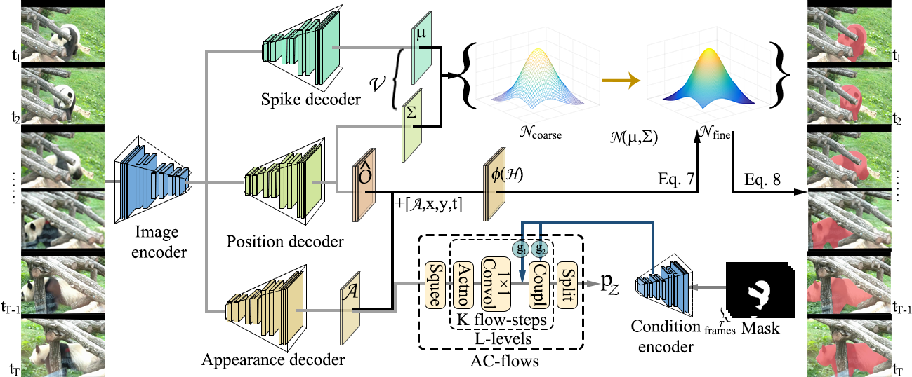

# HEVis
Code for ACMMM 2021 paper: Learning Hierarchical Embeddings for Video Instance Segmentation
and JAS paper: Coarse-to-Fine Video Instance Segmentation with Factorized Conditional Appearance Flows


## Pre-requisites

* OpenCV, numpy, imgaug, pillow, tqdm, pyyaml, tensorboardX, scipy, pycocotools (see `requirements.txt` for exact versions in case you encounter issues)

## dataset

TouTube19, YouTube21, un-DAVIS19, OVIS

## Training 

 ```bash 
   python train.py --model_dir some_dir_name --cfg config.yaml
   ```

## Inference

Assuming the relevant dataset environment variables are correctly set, just run the following commands:


```bash
  python inference.py /path/to/checkpoints/vis.pth -o /path/to/output_dir --dataset ytvis
```
    
## Cite

Use the following BibTeX to cite our work:

```
@inproceedings{qin2021learning,
  title={Learning hierarchical embedding for video instance segmentation},
  author={Qin, Zheyun and Lu, Xiankai and Nie, Xiushan and Zhen, Xiantong and Yin, Yilong},
  booktitle={ACM MM},
  year={2021}
}
```

```
@article{qin2023coarse,
  title=Coarse-to-Fine Video Instance Segmentation with Factorized Conditional Appearance Flows},
  author={Qin, Zheyun and Lu, Xiankai and Nie, Xiushan and Liu, Dongfang and Yin, Yilong and Wang, Wenguan},
  journal={IEEE/CAA Journal of Automatica Sinica},
  year={2023},
  publisher={IEEE}
}
```

## Acknowledgment
STEm-Seg: Spatio-Temporal Embeddings for Instance Segmentation in Videos
